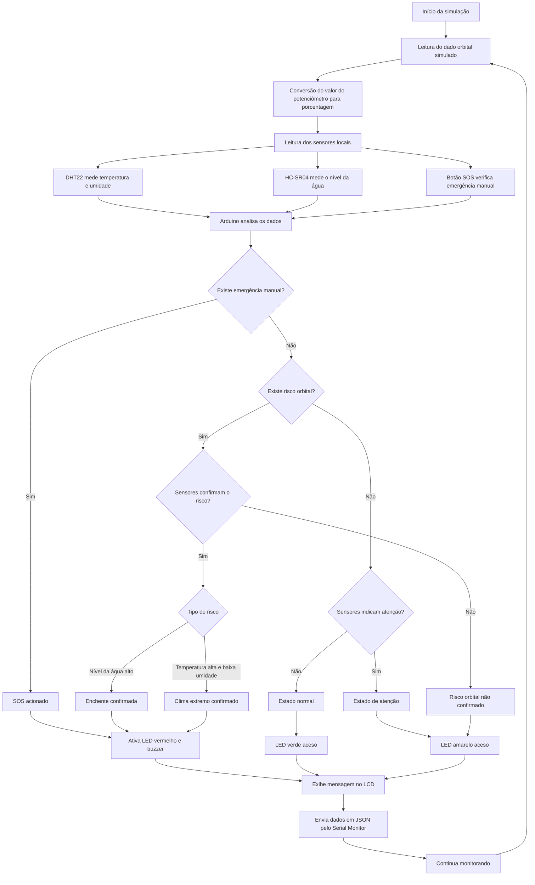
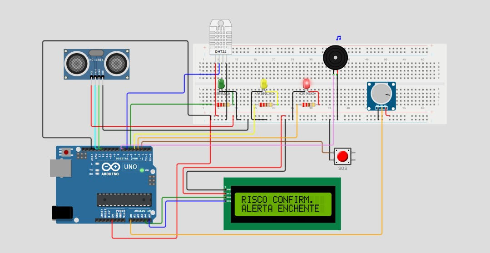

# gs-climasat-alert-edge-computing

## Sistema de Alerta Climático com Dados Orbitais Simulados e Sensores Locais

## Descrição do Projeto

O **ClimaSat Alert** é uma solução desenvolvida em Arduino, simulada no Wokwi, com o objetivo de representar um sistema de alerta climático conectado ao tema da indústria espacial.

O projeto simula o uso de dados orbitais, como se fossem informações recebidas de um satélite, em conjunto com sensores locais instalados em campo. A partir desses dados, o sistema identifica possíveis riscos ambientais e emite alertas visuais, sonoros e informativos.

A solução foi pensada para auxiliar comunidades, escolas, órgãos públicos e equipes de resposta em situações de risco, como enchentes, clima extremo e emergências locais.

---

## Problema Identificado

Eventos climáticos extremos, como enchentes, ondas de calor, baixa umidade e queimadas, podem causar danos sociais, ambientais e econômicos.

Em muitos casos, os alertas chegam tarde ou dependem de poucas fontes de informação. Isso dificulta a prevenção e reduz o tempo de resposta da população e dos órgãos responsáveis.

O **ClimaSat Alert** propõe uma forma de monitoramento que combina uma leitura orbital simulada com sensores locais, tornando o alerta mais contextualizado e rápido.

---

## Objetivo da Solução

O objetivo do projeto é desenvolver uma estação local de monitoramento climático utilizando Arduino e sensores no simulador Wokwi.

A solução busca:

* simular o recebimento de dados orbitais;
* monitorar temperatura, umidade e nível da água;
* identificar situações de atenção e risco;
* emitir alertas visuais com LEDs;
* emitir alertas sonoros com buzzer;
* exibir mensagens no display LCD;
* permitir acionamento manual por botão SOS;
* enviar dados em formato JSON pelo Monitor Serial.

---

## Relação com a Indústria Espacial

O projeto se relaciona com a indústria espacial por utilizar o conceito de **dados orbitais simulados**.

No circuito, o potenciômetro representa uma informação recebida de um satélite. Esse valor indica o nível de risco climático em uma escala de 0% a 100%.

A proposta representa um cenário em que dados vindos do espaço ajudam a monitorar situações na Terra. Esses dados são combinados com sensores locais, permitindo uma análise mais precisa do ambiente.

---

## Relação com Edge Computing

O **ClimaSat Alert** também se relaciona com o conceito de **Edge Computing**, pois a leitura dos sensores, a análise dos dados e a tomada de decisão acontecem diretamente no dispositivo local.

O Arduino realiza o processamento sem depender de um servidor externo para identificar o risco e acionar os alertas. Isso é importante em situações emergenciais, pois permite uma resposta mais rápida, mesmo em locais com conexão limitada.

---

## Componentes Utilizados

| Componente                  | Função no Projeto                       |
| --------------------------- | --------------------------------------- |
| Arduino Uno                 | Controlador principal do sistema        |
| Protoboard                  | Organização das conexões                |
| Sensor DHT22                | Mede temperatura e umidade              |
| Sensor ultrassônico HC-SR04 | Simula o nível da água                  |
| Potenciômetro               | Simula o dado orbital vindo do satélite |
| Pushbutton                  | Botão de emergência SOS                 |
| LED verde                   | Indica estado normal                    |
| LED amarelo                 | Indica estado de atenção                |
| LED vermelho                | Indica estado crítico                   |
| Buzzer                      | Emite alerta sonoro                     |
| LCD 16x2 I2C                | Exibe mensagens do sistema              |
| Resistores                  | Proteção dos LEDs                       |
| Jumpers virtuais            | Conexões entre os componentes           |

---

## Estrutura do Circuito

A montagem foi desenvolvida no simulador **Wokwi**, utilizando Arduino Uno e os componentes disponíveis na plataforma.

### Pinagem Utilizada

| Componente    | Pino no Arduino |
| ------------- | --------------- |
| DHT22         | D6              |
| HC-SR04 TRIG  | D13             |
| HC-SR04 ECHO  | D12             |
| Botão SOS     | D2              |
| LED verde     | D5              |
| LED amarelo   | D4              |
| LED vermelho  | D3              |
| Buzzer        | D7              |
| Potenciômetro | A0              |
| LCD SDA       | A4              |
| LCD SCL       | A5              |

---

## Funcionamento do Sistema

O sistema funciona a partir da combinação entre o dado orbital simulado e os sensores locais.

Primeiro, o potenciômetro gera um valor analógico que representa o risco orbital. Esse valor é convertido para porcentagem usando a função `map()`.

Depois, os sensores locais verificam as condições do ambiente:

* o DHT22 mede temperatura e umidade;
* o HC-SR04 simula o nível da água;
* o botão SOS verifica emergência manual.

Com base nesses dados, o Arduino define o estado do sistema:

* **Normal**
* **Atenção**
* **Risco do satélite não confirmado**
* **Enchente confirmada**
* **Clima extremo confirmado**
* **SOS acionado**

Quando um risco é confirmado, o sistema aciona o LED vermelho, ativa o buzzer e exibe a mensagem correspondente no LCD.

---

## Fluxograma do Funcionamento

O fluxo abaixo representa a lógica geral do sistema, desde a leitura do dado orbital simulado até a emissão dos alertas.



---

## Lógica dos Estados

A lógica do sistema foi organizada em estados. Cada estado representa uma situação identificada a partir da leitura do dado orbital simulado e dos sensores locais.

| Estado                       | Quando ocorre                                                                         | Resposta do sistema                                |
| ---------------------------- | ------------------------------------------------------------------------------------- | -------------------------------------------------- |
| Normal                       | Não há risco orbital e os sensores estão em condição segura                           | LED verde aceso e buzzer desligado                 |
| Atenção                      | Existe algum sinal de monitoramento, mas sem risco crítico confirmado                 | LED amarelo aceso e buzzer desligado               |
| Risco orbital não confirmado | O satélite simulado indica risco, mas os sensores locais ainda não confirmam          | LED amarelo aceso e sistema continua monitorando   |
| Enchente confirmada          | O satélite simulado indica risco e o HC-SR04 detecta nível de água elevado            | LED vermelho aceso, buzzer ativado e alerta no LCD |
| Clima extremo confirmado     | O satélite simulado indica risco e o DHT22 detecta temperatura alta com baixa umidade | LED vermelho aceso, buzzer ativado e alerta no LCD |
| SOS manual                   | O botão de emergência é pressionado                                                   | LED vermelho aceso, buzzer ativado e alerta no LCD |

---

## Parâmetros de Risco

| Condição                                                         | Resultado               |
| ---------------------------------------------------------------- | ----------------------- |
| Satélite entre 0% e 39%                                          | Normal                  |
| Satélite entre 40% e 69%                                         | Atenção                 |
| Satélite entre 70% e 100%                                        | Risco orbital detectado |
| Distância da água abaixo de 25 cm                                | Atenção                 |
| Distância da água abaixo de 15 cm                                | Risco de enchente       |
| Temperatura maior ou igual a 32°C                                | Atenção                 |
| Temperatura maior ou igual a 38°C e umidade menor ou igual a 35% | Risco climático         |
| Botão SOS pressionado                                            | Emergência manual       |

---

## Recursos Técnicos Implementados

### Uso de `millis()`

O projeto utiliza `millis()` para controlar intervalos de leitura dos sensores, atualização do LCD, envio de dados e acionamento do buzzer.

Essa abordagem evita travamentos no código e permite que o sistema continue verificando sensores e botão SOS continuamente.

---

### Uso da função `map()`

A leitura do potenciômetro varia de 0 a 1023. Para facilitar a interpretação, o valor é convertido para uma escala de 0% a 100% usando a função `map()`.

Essa porcentagem representa o nível de risco orbital simulado.

---

### Uso de JSON

O sistema envia dados pelo Monitor Serial em formato JSON, simulando uma estrutura usada em aplicações IoT.

Exemplo de saída:

```json
{
  "projeto": "ClimaSat Alert",
  "temperatura": 24,
  "umidade": 77,
  "distanciaAgua": 20,
  "satelitePercentual": 72,
  "status": "RISCO CONFIRMADO",
  "alerta": "ALERTA ENCHENTE",
  "sos": false
}
```

Esse formato facilita uma possível integração futura com dashboards, APIs, bancos de dados e plataformas em nuvem.

---

## Relação com IoT

O projeto foi desenvolvido em ambiente simulado, mas representa uma base compatível com conceitos de Internet das Coisas.

Em uma aplicação real, os dados poderiam ser enviados para:

* dashboard web;
* servidor próprio;
* API;
* banco de dados;
* plataforma em nuvem;
* sistemas de alerta da Defesa Civil.

Fluxo proposto:

```text
Sensores locais → Arduino → Processamento local → JSON → Dashboard ou plataforma externa
```

---

## Imagem do Circuito

A imagem abaixo apresenta o circuito montado no Wokwi:



---

## Instruções de Execução

1. Acesse o link da simulação no Wokwi.
2. Clique em **Start Simulation**.
3. Aguarde a inicialização do LCD.
4. Abra o **Serial Monitor**.
5. Altere o potenciômetro para simular o nível de risco orbital.
6. Altere a distância do sensor ultrassônico para simular nível da água.
7. Altere a temperatura e a umidade no DHT22 para simular clima extremo.
8. Pressione o botão SOS para simular emergência manual.
9. Observe os LEDs, buzzer, LCD e dados enviados pelo Serial Monitor.

---

## Testes Realizados

### Teste 1 — Estado Normal

Condições:

* satélite abaixo de 40%;
* distância da água acima de 25 cm;
* temperatura abaixo de 32°C;
* umidade em condição segura;
* botão SOS solto.

Resultado esperado no sistema:

* LED verde aceso;
* LED amarelo apagado;
* LED vermelho apagado;
* buzzer desligado.

Resultado esperado no LCD:

```text
STATUS NORMAL
SAT: 0%
```

---

### Teste 2 — Estado de Atenção

Condições:

* satélite entre 40% e 69%;
* sensores locais sem risco crítico;
* botão SOS solto.

Resultado esperado no sistema:

* LED amarelo aceso;
* LED verde apagado;
* LED vermelho apagado;
* buzzer desligado.

Resultado esperado no LCD:

```text
STATUS ATENCAO
MONITORANDO
```

---

### Teste 3 — Risco Orbital Não Confirmado

Condições:

* satélite acima de 70%;
* sensores locais em condição segura;
* botão SOS solto.

Resultado esperado no sistema:

* LED amarelo aceso;
* LED vermelho apagado;
* buzzer desligado;
* sistema aguardando confirmação dos sensores locais.

Resultado esperado no LCD:

```text
RISCO SATELITE
NAO CONFIRMADO
```

---

### Teste 4 — Enchente Confirmada

Condições:

* satélite acima de 70%;
* distância do HC-SR04 abaixo de 15 cm;
* botão SOS solto.

Resultado esperado no sistema:

* LED vermelho aceso;
* LED verde apagado;
* LED amarelo apagado;
* buzzer ativado;
* alerta crítico confirmado.

Resultado esperado no LCD:

```text
RISCO CONFIRM.
ALERTA ENCHENTE
```

---

### Teste 5 — Clima Extremo Confirmado

Condições:

* satélite acima de 70%;
* temperatura maior ou igual a 38°C;
* umidade menor ou igual a 35%;
* botão SOS solto.

Resultado esperado no sistema:

* LED vermelho aceso;
* LED verde apagado;
* LED amarelo apagado;
* buzzer ativado;
* alerta climático confirmado.

Resultado esperado no LCD:

```text
RISCO CONFIRM.
ALERTA CLIMA
```

---

### Teste 6 — SOS Manual

Condições:

* botão SOS pressionado.

Resultado esperado no sistema:

* LED vermelho aceso;
* LED verde apagado;
* LED amarelo apagado;
* buzzer ativado;
* emergência manual registrada.

Resultado esperado no LCD:

```text
RISCO CONFIRM.
SOS ACIONADO
```

---

## Arquivos do Projeto

O repositório contém os seguintes arquivos:

```text
climasat-alert/
│
├── sketch.ino
├── diagram.json
├── libraries.txt
├── README.md
└── assets/
    └── circuito-wokwi.png
```

---

## Bibliotecas Utilizadas

O arquivo `libraries.txt` contém:

```text
DHT sensor library
LiquidCrystal I2C
ArduinoJson
```

---

## Link da Simulação no Wokwi

[Simulação no Wokwi](https://youtu.be/thzLjDbHwK8)

---

## Link do Vídeo da Solução

[Vídeo da solução](https://youtu.be/thzLjDbHwK8)


---

## Integrantes do Grupo

| Nome completo             | RM       |
| ------------------------- | -------- |
| Guilherme Mingues         | RM568670 |
| Renato Munhoz Mariana     | RM573570 |
| Murillo Padula de Gouveia | RM571620 |
| Gabriel Vianna Cumino     | RM571475 |

---

## Conclusão

O **ClimaSat Alert** demonstra como dados orbitais simulados e sensores locais podem atuar em conjunto para melhorar o monitoramento de riscos climáticos.

A solução realiza a leitura, análise e resposta diretamente no dispositivo local, representando uma aplicação prática de **Edge Computing**.

Com alertas visuais, sonoros, informativos e envio de dados em JSON, o projeto apresenta uma base funcional para futuras integrações com sistemas IoT, dashboards e plataformas de monitoramento climático.
